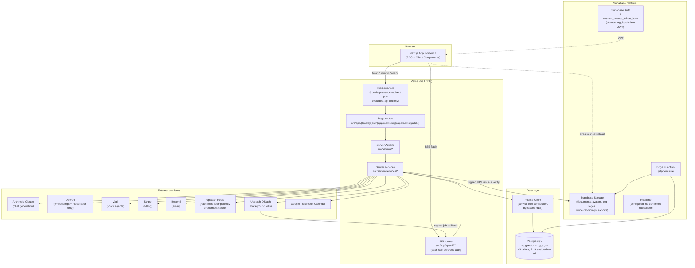
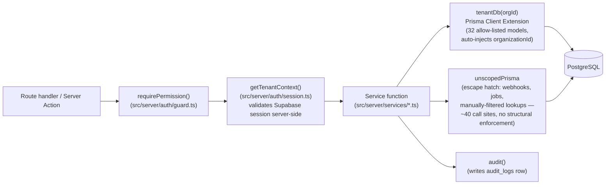
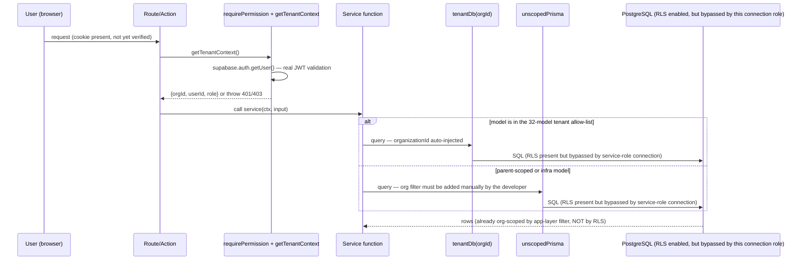
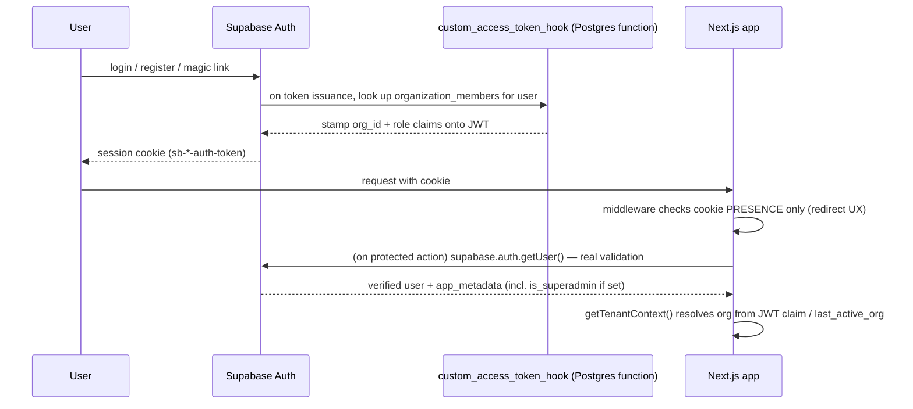
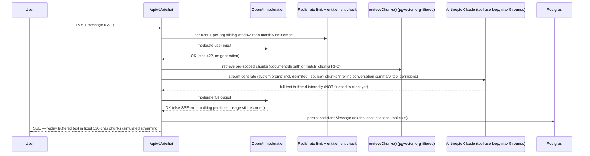

# Syveka AI — Architecture

Snapshot date: **2026-07-23**. Describes the system as it actually exists in the repository,
not an aspirational design. Do not redesign based on this document alone — see
`PROJECT-CONTEXT.md` §9 for decisions requiring approval before architectural change.

## 1. High-level component map

## 2. Frontend architecture

- **Next.js 15 App Router**, route groups partition the app by access level:
  `(auth)` unauthenticated auth flows, `(app)` the authenticated SaaS shell, `(marketing)`
  public landing/pricing, `(superadmin)` internal ops (gated by `layout.tsx` calling
  `requireSuperadmin()` server-side, not by folder structure alone), `(public)` unauthenticated
  org-scoped pages (public booking).
- All routes are nested under `src/app/[locale]/...` — `next-intl` provides locale routing
  (`fi` default, `as-needed` prefix) and RTL is applied once, globally, via
  `<html dir={locale==="ar" ? "rtl" : "ltr"}>` in the root locale layout.
- Data fetching is overwhelmingly **Server Components + Server Actions**, not client-side
  fetching: `@tanstack/react-query`'s `QueryProvider` wraps the app but has zero
  `useQuery`/`useMutation` consumers anywhere in `src/` — it is unused scaffolding. The one
  exception is the AI chat surface, which hand-rolls SSE consumption in `src/hooks/use-chat.ts`
  rather than using react-query.
- `zustand` is an installed but entirely unused dependency (`src/stores/` is empty).
- Only `/dashboard` has a dedicated `loading.tsx`/`error.tsx` pair; all other routes rely on
  Next.js defaults.

## 3. Backend architecture

- Business logic lives almost entirely in `src/server/services/*.ts` (one file per domain).
  `src/actions/*.ts` (Server Actions, used by authenticated app UI) and
  `src/app/api/v1/**/route.ts` (API routes, used by public/webhook/job/booking callers) are
  both **thin transport layers** that call the same service functions — no duplicated business
  logic was found between the two transports.
- **Authorization is layered, not single-gate**: `middleware.ts` only checks Supabase session
  *cookie presence* (a UX redirect, not a security boundary) and its matcher **excludes all
  `/api` routes**. Every Server Action and API route independently calls `requirePermission()`
  (which calls `getTenantContext()`, which performs a real `supabase.auth.getUser()` validation)
  or, for webhooks/jobs, its own signature-verification function. This was spot-checked across
  the highest-traffic routes and found consistent, but is not structurally enforced by a lint
  rule or test — see `SECURITY-AUDIT.md` finding on this.
- Superadmin is a **separate authorization axis** from the RBAC role matrix — gated on
  `auth.users.app_metadata.is_superadmin`, settable only via the Supabase dashboard, never
  through app UI.

## 4. Database architecture

- 43 Prisma models, all mapped to snake_case Postgres tables, all with RLS enabled.
- Tenant scoping pattern: every business model carries `organizationId`, except models that
  are deliberately parent-scoped only (documented via code comments — e.g. `Message` via
  `Conversation`, `EventAttendee` via `CalendarEvent`).
- **Composite FK pattern** (`@@unique([organizationId, id])` on the parent + composite FK on
  the child) is used for the three highest-risk KB/chat relations (`Document`↔`Collection`,
  `DocumentChunk`↔`Document`, `ConversationDocument`↔`Conversation`/`Document`) — added
  retroactively in a same-day follow-up migration after shipping without it. Not used for most
  other relations (`Contact.company`, `Deal.contact`, etc.), which rely on application
  discipline (`tenantDb`) rather than a DB-level guarantee.
- **`DocumentUploadIntent` has no FK relationship to `Document` at all** — correlated only by
  matching `storagePath` in application code, backed by a `CHECK` constraint that a storage
  path must be prefixed with its own `organization_id`.
- Migrations are tracked in `prisma/migrations/` (10, chronological `20260701`–`20260719`).
  A **separate, hand-applied SQL directory** `prisma/sql/001`–`006` provisions extensions,
  functions, RLS, and — critically — **Supabase Storage buckets/policies, which have no tracked
  migration equivalent**. These two systems must be kept in sync manually; tooling
  (`check-migration-history.mjs`, `check-dashboard-index-ownership.mjs`,
  `generate-legacy-schema-contract.mjs`) exists specifically to guard against this drift.
- See `DATABASE-AUDIT.md` for the full model-by-model and migration-by-migration breakdown.

## 5. Tenant-isolation flow (the most important flow to understand correctly)

**Key fact, verified in `DATABASE-AUDIT.md`**: `DATABASE_URL`/`DIRECT_URL` connect as the
Supabase-provisioned Postgres role used for direct/pooled connections, which bypasses RLS
(confirmed by the codebase's own comments: `src/server/db/prisma.ts:6-9` and
`prisma/sql/003_rls.sql:2-3`). This means **RLS today protects only the Supabase-native client
paths** (PostgREST, Realtime, Storage) — not the Prisma/Next.js application, where 100% of
product logic runs. Real tenant isolation for the product rests on `tenantDb()`'s automatic
`organizationId` injection plus manual discipline at ~40 `unscopedPrisma` call sites (sampled
and found correct, but not structurally guaranteed).

## 6. Authentication flow

## 7. AI and RAG flow

Document ingestion (separate flow, feeds `RAG` above):
`upload-url (quota+intent) → direct client PUT to Supabase Storage → finalize (byte-verify
magic bytes, consume intent transactionally) → enqueue embed-document job (QStash) → isolated
worker-thread text extraction (SSRF-safe for URLs, zip-bomb-safe for DOCX, sandboxed
resource/time limits) → chunk → embed (OpenAI, batched) → store vectors (pgvector) → status
READY`. See `AI-RAG-AUDIT.md` for full detail, including the one same-tenant (non-cross-tenant)
consistency gap found between the two retrieval code paths.

## 8. Billing flow

`Stripe Checkout (locale-aware, VAT collection) → webhook (signature-verified, Redis-deduped by
event.id) → Subscription upsert → Entitlements (60s Redis-cached) gate AI messages, voice
minutes, contacts, workflow activation, seats, storage → Billing Portal for self-serve plan
management.` Plan matrix: FREE/STARTER/PRO/ENTERPRISE across 9 usage dimensions
(`src/server/services/billing/plans.ts`).

## 9. Voice flow

`VoiceAssistant config → syncToVapi() (injects locale AI-disclosure text, KB search tool if
enabled, 15-min max duration) → Vapi provisions assistant + Finnish number → inbound/outbound
call → webhook (HMAC-SHA256 signature verified, timing-safe compare) → VoiceCall upsert →
post-call job (summary, sentiment, CRM activity write, actions-taken log)`.

## 10. Deployment flow

```mermaid
flowchart LR
    PR["PR to main"] --> CI["ci.yml — 14 jobs\n(install, prisma validate/generate,\nmigration structure, lint, typecheck,\ntests, RLS, migration-upgrade drift tests,\nbuild, dependency audit x2, i18n, secret scan)"]
    CI --> Required["ci-required fan-in check"]
    Required --> Merge["Merge to main"]
    Merge --> StagingDispatch["Manual workflow_dispatch:\nstaging-release.yml\n(exact SHA, staging project ref\ncross-checked against prod deny-list)"]
    StagingDispatch --> StagingDeploy["Migrate staging DB, RLS/tenant SQL\nassertions, deploy separate Vercel\nstaging project, Playwright E2E smoke"]
    StagingDeploy --> ProdDispatch["Manual workflow_dispatch:\ndeploy.yml (SHA typed twice)"]
    ProdDispatch --> Verify["verify-release-chain.ts:\nconfirms SHA is main tip AND has\nsuccessful CI run AND successful\nstaging run at that exact SHA"]
    Verify --> Approval["Protected 'production' GitHub\nEnvironment — manual reviewer approval"]
    Approval --> ProdDeploy["Read-only preflight, prisma migrate deploy,\nstorage compat SQL, pinned Vercel CLI deploy,\n/api/health poll"]
```

Both release workflows are `workflow_dispatch`-only (no automatic `push`/`workflow_run`
trigger) and restricted to `main`. This is a deliberately conservative, manually-gated pipeline
— see `docs/release-runbook.md` (pre-existing, verified accurate) for full operational detail.

## 11. Important technical tradeoffs (as-built, worth preserving context on)

| Tradeoff | Why it was made | Where documented |
|---|---|---|
| Buffered "fake" SSE streaming instead of true token streaming | Output must pass moderation before any text reaches the client — a deliberate safety-over-latency choice | `docs/ai-chat-production-hardening.md`, confirmed in `route.ts` |
| RLS enabled everywhere but not load-bearing for the app | Prisma needs a role that isn't blocked by RLS for legitimate cross-tenant admin/job operations; RLS is kept as a backstop for the Supabase-native client surface instead | `prisma/sql/003_rls.sql` comment, `DATABASE-AUDIT.md` §6 |
| Two parallel migration systems (Prisma DDL + hand-applied SQL) | Prisma cannot model RLS policies or Supabase Storage's `storage` schema | `docs/release-runbook.md`, `ARCHITECTURE.md` §4 |
| Booking assistant LLM never decides availability | Prevents hallucinated/incorrect booking slots — model only ranks/explains deterministically-computed slots | `docs/calendar-booking-v1.md` |
| Anthropic-only generation despite router/fallback scaffolding | Simpler operationally; fallback code was written but never finished/wired | `AI-RAG-AUDIT.md` §1 |
| Dynamic `Promise.all([import(...)])` at the top of most route handlers | Serverless cold-start/bundle-splitting optimization, applied as a consistent house style | Repeated pattern across `route.ts` files |
