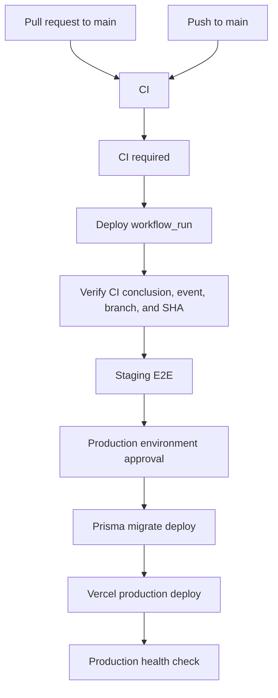

# CI and Deployment Enforcement

This document captures the manual GitHub settings that must accompany the workflow enforcement in `.github/workflows/ci.yml` and `.github/workflows/deploy.yml`.

## Branch Protection Or Ruleset

Enable a branch ruleset for `main` with these settings:

- Block direct pushes unless they pass the same pull request and status-check requirements. Prefer "Require a pull request before merging" and do not allow bypasses except repository administrators who are bound by an audited emergency process.
- Require status checks to pass before merging.
- Require branches to be up to date before merging.
- Require the workflow status check named `CI required`.
- Require conversation resolution before merging.
- Require signed commits if this is part of the organization baseline.
- Restrict who can push to matching branches to the release automation or approved maintainers only.
- Do not allow force pushes.
- Do not allow deletions.

Required status-check name:

- `CI required`

The detailed CI jobs are intentionally visible as separate checks, but branch protection should require the aggregate `CI required` check so newly split CI internals do not silently weaken protection.

## Environments

Create a `staging` environment:

- No manual approval required unless the organization wants review before staging tests.
- Environment variable `STAGING_URL` must point to the already-deployed staging application used by Playwright.
- Secrets `E2E_USER_EMAIL` and `E2E_USER_PASSWORD` must identify a seeded, non-production E2E account.

Create a `production` environment:

- Require reviewer approval before deployment.
- Restrict deployment branches to `main`.
- Keep environment secrets scoped to production only.
- Optional but recommended: configure wait timers or custom deployment protection rules if required by the release process.

Disable any independent Vercel, hosting-provider, or GitHub deployment path that can deploy production directly from `main`. Production deployment should be performed only by the `Deploy` workflow after the successful `CI` workflow_run handoff.

## Secrets And Variables

Repository or environment variables:

- `STAGING_URL`
- `PROD_URL`

Secrets:

- `E2E_USER_EMAIL`
- `E2E_USER_PASSWORD`
- `PROD_DATABASE_URL`
- `PROD_DIRECT_URL`
- `VERCEL_TOKEN`
- `GITHUB_TOKEN` is provided automatically by GitHub Actions.

## Flow

The `Deploy` workflow has no direct `push` trigger. It starts only after `CI` completes on `main`, validates that the CI conclusion is `success`, validates that the source event was a `push`, and checks out `github.event.workflow_run.head_sha` for every deployment step.

## Database Migration Order

Production uses `npx prisma migrate deploy`, which applies pending tracked migrations in lexical order.
For the current Calendar, Booking, AI Chat, Knowledge Base, CRM, and security release, the order is:

1. `20260712000000_dashboard_indexes`
2. `20260712120000_crm_contacts_companies_v1`
3. `20260712180000_crm_deals_v1`
4. `20260713000000_calendar_booking_v1`
5. `20260714000000_secure_document_upload_intents`
6. `20260715000000_ai_chat_production_hardening`
7. `20260715230000_security_invariant_corrections`
8. `20260718000000_calendar_booking_rls`

The final migration enables RLS for every Calendar/Booking V1 table and creates only the intended
authenticated SELECT policies. Server-only connection, token, reminder, and synchronization tables
remain deny-by-default. Do not run `prisma/sql/005_calendar_booking_rls.sql` separately; it is only a
compatibility wrapper for older setup instructions.

Before production migration, confirm backup/PITR readiness, inspect pending `_prisma_migrations`, and
run tenant-integrity preflight checks. After migration, verify the migration row, RLS flags, expected
policies, and absence of authenticated policies on the server-only tables before deploying the
application. Roll back the application before considering a database corrective migration; do not
drop RLS or tenant policies as a routine rollback.
