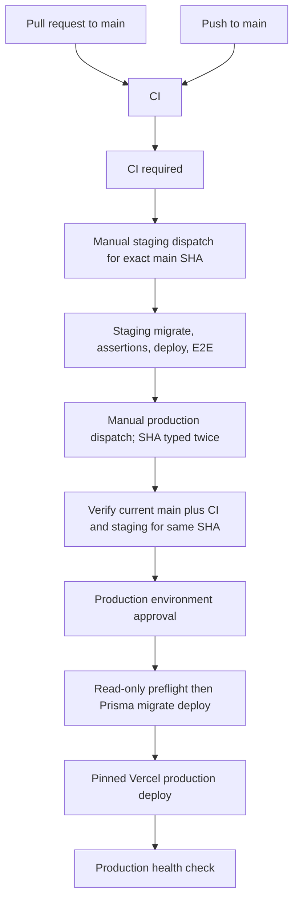

# CI and Deployment Enforcement

This document captures the manual GitHub settings that must accompany the workflow enforcement in `.github/workflows/ci.yml` and `.github/workflows/deploy.yml`.

## Branch Protection Or Ruleset

Enable a branch ruleset for `main` with these settings:

- Block direct pushes unless they pass the same pull request and status-check requirements. Prefer "Require a pull request before merging" and do not allow bypasses except repository administrators who are bound by an audited emergency process.
- Require status checks to pass before merging.
- Require branches to be up to date before merging.
- Require the workflow status check named `CI required`.
- Require conversation resolution before merging.
- Require signed commits if this is part of the organization baseline.
- Restrict who can push to matching branches to the release automation or approved maintainers only.
- Do not allow force pushes.
- Do not allow deletions.

Required status-check name:

- `CI required`

The detailed CI jobs are intentionally visible as separate checks, but branch protection should require the aggregate `CI required` check so newly split CI internals do not silently weaken protection.

## Environments

Create a `staging` environment:

- Use a separate Supabase project and a separate Vercel project containing no production data.
- Prefer reviewer approval and restrict deployment to trusted branches.
- Configure the staging-only variables and secrets listed in `docs/release-runbook.md`.
- Run `.github/workflows/staging-release.yml` manually and type the staging project ref. The workflow migrates and validates staging before deploying the application.

Create a `production` environment:

- Require reviewer approval before deployment.
- Restrict deployment branches to `main`.
- Keep environment secrets scoped to production only.
- Optional but recommended: configure wait timers or custom deployment protection rules if required by the release process.

Disable any independent Vercel, hosting-provider, or GitHub deployment path that
can deploy production directly from `main`. Production deployment is allowed
only through the manually dispatched `Production release` workflow.

## Secrets And Variables

Repository or environment variables:

- `PROD_URL`
- `STAGING_SUPABASE_PROJECT_REF`
- `STAGING_SUPABASE_URL`
- `PRODUCTION_SUPABASE_PROJECT_REF`
- `PRODUCTION_VERCEL_PROJECT_ID`

Secrets:

- See `docs/release-runbook.md` for the staging workflow's `STAGING_*` secrets.
- `PROD_DATABASE_URL`
- `PROD_DIRECT_URL`
- `VERCEL_TOKEN`
- `VERCEL_ORG_ID`
- `VERCEL_PROJECT_ID`
- `GITHUB_TOKEN` is provided automatically by GitHub Actions.

## Flow

Neither release workflow has a `push` or `workflow_run` trigger. Both are
main-only manual dispatches. Production accepts an exact lowercase 40-character
SHA, requires the operator to type it twice, verifies it is the current `main`
tip, and requires successful main-push CI plus staging `workflow_dispatch` runs
for that same SHA before production Environment approval is requested.

The release workflows become dispatchable only after their files are merged to
the default branch. The first safe sequence is: merge with CI only, configure
the protected Environments, dispatch staging on the merge SHA, and only then
consider a production dispatch. Do not temporarily add an automatic trigger to
bootstrap the workflows.

## Database Migration Order

Production uses `npx prisma migrate deploy`, which applies pending tracked migrations in lexical order.
For the current Calendar, Booking, AI Chat, Knowledge Base, CRM, and security release, the order is:

1. `20260701000000_initial_baseline`
2. `20260712000000_dashboard_indexes`
3. `20260712120000_crm_contacts_companies_v1`
4. `20260712180000_crm_deals_v1`
5. `20260713000000_calendar_booking_v1`
6. `20260714000000_secure_document_upload_intents`
7. `20260715000000_ai_chat_production_hardening`
8. `20260715230000_security_invariant_corrections`
9. `20260718000000_calendar_booking_rls`
10. `20260719000000_initial_security_baseline`

Migration 9 enables RLS for every Calendar/Booking V1 table and creates only the intended
authenticated SELECT policies. Server-only connection, token, reminder, and synchronization tables
remain deny-by-default. Do not run `prisma/sql/005_calendar_booking_rls.sql` separately; it is only a
compatibility wrapper for older setup instructions.

Migration 10 additively tracks the original manually provisioned functions, search indexes, and base
RLS policies. See `docs/release-runbook.md` for the empty-database baseline decision and release steps.

Before production migration, confirm backup/PITR readiness, inspect pending `_prisma_migrations`, and
run `prisma/sql/006_legacy_baseline_preflight.sql`. After migration, verify the migration row, RLS flags, expected
policies, and absence of authenticated policies on the server-only tables before deploying the
application. Roll back the application before considering a database corrective migration; do not
drop RLS or tenant policies as a routine rollback.
